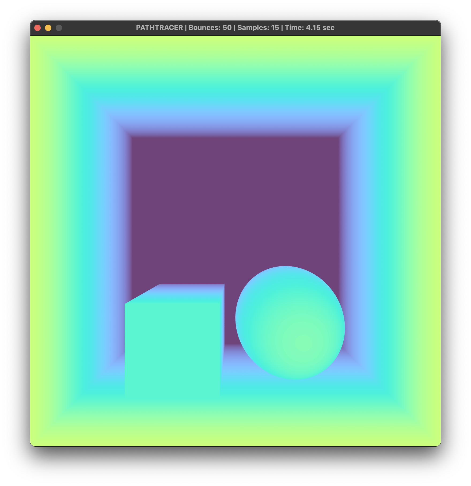
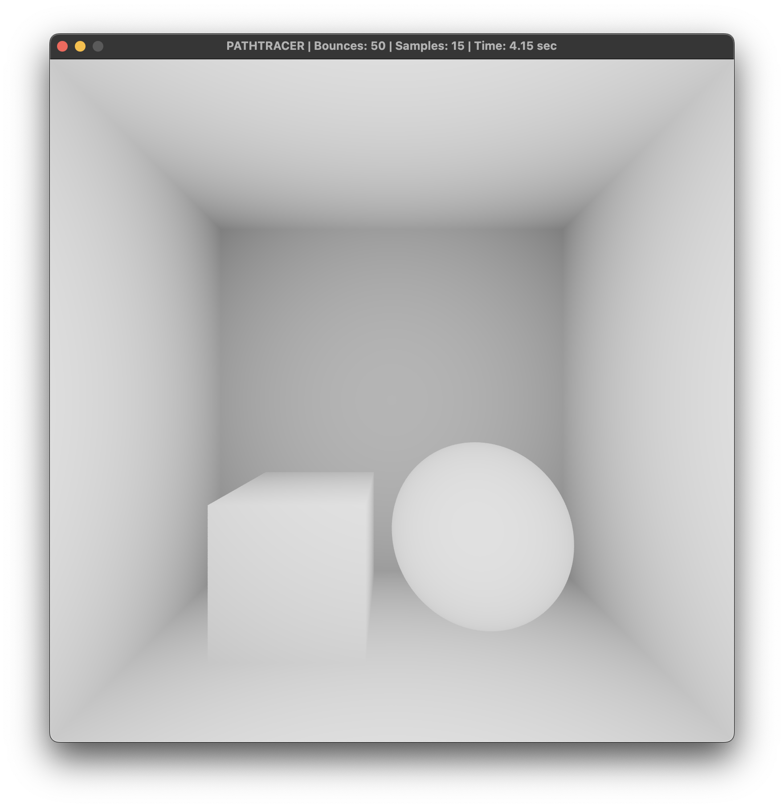

# PathTracer
## Written in C++ using SFML for cross-platform windowing and event handling.

### Description
CPU based Pathtracer with multi-threaded chunk rendering system.  
Initially implemented for Advanced Programming in C++ university course, based on books such as **RTOW 1** by Peter Shirley and **Physically Based Rendering** by Matt Pharr, Wenzel Jakob and Greg Humphreys.

### Features
Supports several rendering modes and user interaction such as:
- Regular rendering mode (1),
- Depth-based visualisation mode (2),
- Normal-based visualisation mode (4),
- Time-based visualisation mode using Turbo colormap (3),
- Camera movement (WASDQE),
- Sample count adjustment (UP/DOWN),
- Switching between multiple scenes (LEFT/RIGHT)

### Additional images

